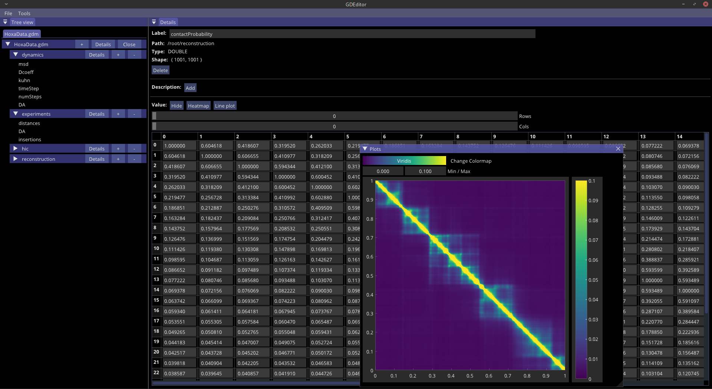

<!-- PROJECT LOGO -->
<h1 align="center">General Data Manager (GDM) </h1>

GDM is a C++ library that allows to save data in an structured and easy to acess binary file. The file is organized into groups that may contain other groups and data as vectors and 2D matrices. For easier sharing (and remembering), every object may contain description tags explaning several aspects of any given group or data. For simplicity, a Python API is also provided, wrapping core functionality.

GDM files are read using a "lazy" approach, so the user can optimize RAM usage when working with a great amount of data.

## GDEditor


The GDM editor can be used to verify the file structure, that is, which groups are present, containing data with label, shape and format. One can also re-label, include and delete objects. As an extra utility, one can plot matrices as heatmaps or line plots from rows or columns.

## Getting Started

1. Clone the repo. If you want to use GDEditor, a recursive clone is needed as I use GRender for the user interface.

   ```
   git clone --recurse-submodules -j4 https://github.com/guilmont/GDManager.git
   ```

2. Setup options accordingly:
  - CMAKE_BUILD_TYPE: For standard use, set it to Release
  - CMAKE_INSTALL_PREFIX: Alter path for desired installation path
  - GDM_CMD_VIEWER: Compiles a command line program to display gdm-file structure
  - GDM_EDITOR: Compiles the user interface for editing gdm-files
    - GRENDER_DPI_FACTOR: Should be set ON for HIDPI monitors
  - GDM_TEST: Compiles a template program that generates a test gdm-file
  - GDM_PYTHON_BINDING: Generates GDManager python libraries

3. Build and install.

## To-do-list
  1) Improve plotting capabilities
  2) Version two will present a better binary organization, allowing for direct file modification, that is, content won't need to be rewritten when saved.

<br/>


---

Copyright 2021 Guilherme MONTEIRO OLIVEIRA